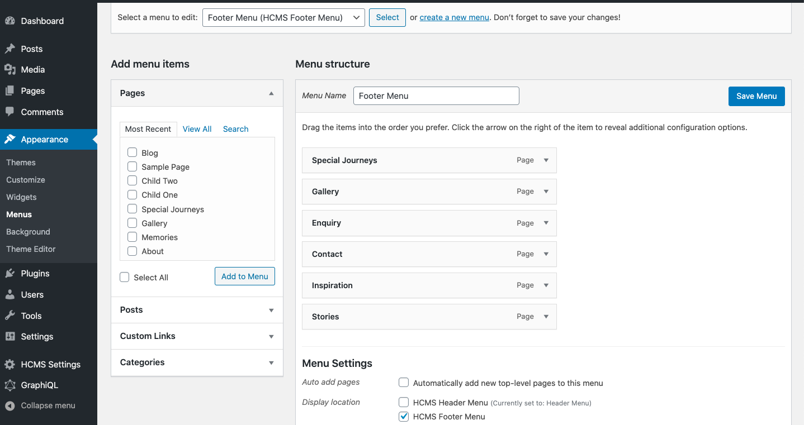

## 🎨 [Gatsby WooCommerce themes](https://gatsby-woocommerce-theme.netlify.app/)
[](https://www.repostatus.org/#active)


- A Gatsby theme for WooCommerce, using Decoupled Architecture.
- Front end in React
- Backend in WordPress.

[Demo Site](https://gatsby-woocommerce-theme.netlify.app/)

This theme uses `gatsby-source-wordpress@v4 BETA`

*** 👨‍💻 Please star my repo to support my work 🙏 ***

## 🔥 Features
1. Uses React with Gatsby ( Blazing Fast )
2. PWA ( Works Offline )
3. Image Optimization ( blur effect )
4. GraphQL ( with wp-graphql on WordPress )
5. Custom Widgets, Menus, Social elements.
6. WooCommerce store
7. Google Analytics feature
8. Yoast SEO supported.
9. Product Search with pagination ( even works offline ) 
10.Product pagination
11. Archive pages.

## 👨‍💻 Maintainer

| Name                                                   | Github Username |
|--------------------------------------------------------|-----------------|
| [Imran Sayed](mailto:codeytek.academy@gmail.com)       |  @imranhsayed   |

## 🚀 Set Up

### Gatsby Setup
* Rename `.env-example` file to `.env` and add your WordPress SITE_URL in `site` directory : 
- `SITE_URL=https://example.com`
- `GATSBY_SITE_URL=https://example.com`
- `GOOGLE_TAGMANAGER_ID=xxx`

### Client config. 
rename client-config-example.js in packages/gatsby-woocommerce-theme directory to client-config.js and add your WordPress Site URL. 

### WordPress Setup
1. Download, Upload and activate all the plugins from wordpress/plugins folder of this repo, into your WordPress Site.

a. [Headless CMS](https://github.com/imranhsayed/gatsby-woocommerce-themes/blob/master/wordpress/plugins/headless-cms.zip)
b. [wp-graphql](https://github.com/imranhsayed/gatsby-woocommerce-themes/blob/master/wordpress/plugins/wp-graphql.zip) - tested on ( v1.0.0 )
c. [wp-graphiql](https://github.com/imranhsayed/gatsby-woocommerce-themes/blob/master/wordpress/plugins/wp-graphiql.zip)
d. [wp-graphql-woocommerce](https://github.com/imranhsayed/gatsby-woocommerce-themes/blob/master/wordpress/plugins/wp-graphql-woocommerce.zip)
e. [wp-gatsby](https://github.com/imranhsayed/gatsby-woocommerce-themes/blob/master/wordpress/plugins/wp-gatsby.zip)
f. [Yoast-SEO](https://github.com/imranhsayed/gatsby-woocommerce-themes/blob/master/wordpress/plugins/wordpress-seo.14.5.zip)
g. [wp-graphql-yoast-seo](https://github.com/imranhsayed/gatsby-woocommerce-themes/blob/master/wordpress/plugins/wp-graphql-yoast-seo.zip)


2. - Set Header menu as `HCMS Header Menu`
   
   
   
   - Set Footer menu as `HCMS Footer Menu`
   
   
3. You can also set text widgets in #HCMS Footer #1 and #HCMS Footer #2 under Appearance  > Widgets in WordPress.
4. Import all the ACF data from `wordpress/acf-data` json file of this repo, into WordPress by going to WordPress Dashboard > Custom Fields > Tools > Import
5. Create a Home Page ( if there isn't one already )and make sure you have a home page and Location rule is set to Home page.

7. If isn't already set your site title, description and logo from WordPress customizer.
8. Setup WooCommerce:
* Make sure WooCommerce Plugin is active in WordPress and the payment modes have been set from its settings.
* You can also import default wooCommerce products that come with wooCommerce Plugin for development ( if you don't have any products in your WordPress install ) `WP Dashboard > Tools > Import > WooCommerce products(CSV)`: The WooCommerce default products csv file is available at wp-content/plugins/woocommerce/sample-data/sample_products.csv
    

## 🚀 Development

* Navigate into site’s directory.

```shell
yarn install      # Run this for the first time.
npm run dev      # During development.
npm run build    # When ready for production.
```

** For development **
Your site is now running at `http://localhost:8000`!

_Note: You'll also see a second link: _`http://localhost:8000/___graphql`_. This is a tool you can use to experiment with querying your data.

### 📕 Storybook:

For Storybook:

* `cd package/gatsby-wooocommerce-theme`
* `npm run storybook`


### :package: Adding/Removing a new package to site folder

`yarn workspace site add package-name`
`yarn workspace site remove package-name`

### :package: Adding/Removing a new package to gatsby-wooocommerce-theme folder

`yarn workspace gatsby-wooocommerce-theme add package-name`
`yarn workspace gatsby-wooocommerce-theme remove package-name`

## 🧐 What's inside?

A quick look at the top-level files and directories you'll see in a Gatsby project.

    .
    ├── node_modules
    ├── demos
    ├── packages
    ├── src
    ├── .gitignore
    ├── .site
    ├── gatsby-browser.js
    ├── gatsby-config.js
    ├── gatsby-node.js
    ├── gatsby-ssr.js
    ├── package-lock.json
    ├── package.json
    └── README.md

1.  **`/node_modules`**: This directory contains all of the modules of code that your project depends on (npm packages) are automatically installed.

2.  **`/src`**: This directory will contain all of the code related to what you will see on the front-end of your site (what you see in the browser) such as your site header or a page template. `src` is a convention for “source code”.

3.  **`.gitignore`**: This file tells git which files it should not track / not maintain a version history for.

4.  **`.prettierrc`**: This is a configuration file for [Prettier](https://prettier.io/). Prettier is a tool to help keep the formatting of your code consistent.

5.  **`gatsby-browser.js`**: This file is where Gatsby expects to find any usage of the [Gatsby browser APIs](https://www.gatsbyjs.org/docs/browser-apis/) (if any). These allow customization/extension of default Gatsby settings affecting the browser.

6.  **`gatsby-config.js`**: This is the main configuration file for a Gatsby site. This is where you can specify information about your site (metadata) like the site title and description, which Gatsby plugins you’d like to include, etc. (Check out the [config docs](https://www.gatsbyjs.org/docs/gatsby-config/) for more detail).

7.  **`gatsby-node.js`**: This file is where Gatsby expects to find any usage of the [Gatsby Node APIs](https://www.gatsbyjs.org/docs/node-apis/) (if any). These allow customization/extension of default Gatsby settings affecting pieces of the site build process.

8.  **`gatsby-ssr.js`**: This file is where Gatsby expects to find any usage of the [Gatsby server-side rendering APIs](https://www.gatsbyjs.org/docs/ssr-apis/) (if any). These allow customization of default Gatsby settings affecting server-side rendering.

9.  **`LICENSE`**: Gatsby is licensed under the MIT license.

10. **`package-lock.json`** (See `package.json` below, first). This is an automatically generated file based on the exact versions of your npm dependencies that were installed for your project. **(You won’t change this file directly).**

11. **`package.json`**: A manifest file for Node.js projects, which includes things like metadata (the project’s name, author, etc). This manifest is how npm knows which packages to install for your project.

12. **`README.md`**: A text file containing useful reference information about your project.

### Useful Links ###
1. [Setting workspaces with yarn](https://www.gatsbyjs.org/blog/2019-05-22-setting-up-yarn-workspaces-for-theme-development/) for theme development
2. [Installing a gatsby theme](https://www.gatsbyjs.org/docs/themes/using-a-gatsby-theme/) and setting it up.

### Deployment
#### With vercel

- Signup on [vercel.com](https://vercel.com/)
- Click on Import Project and then add the configurations.


- On [vercel](https://vercel.com/), make sure you add these from settings of the project:


#### From CLI:
- `npm i -g vercel`
- Now in the project root run
`vercel`

- Add the following configurations
* build command: `npm run build`
* output directory: `site/public`
* development command: `npm run dev` 
* root directory: `/`
